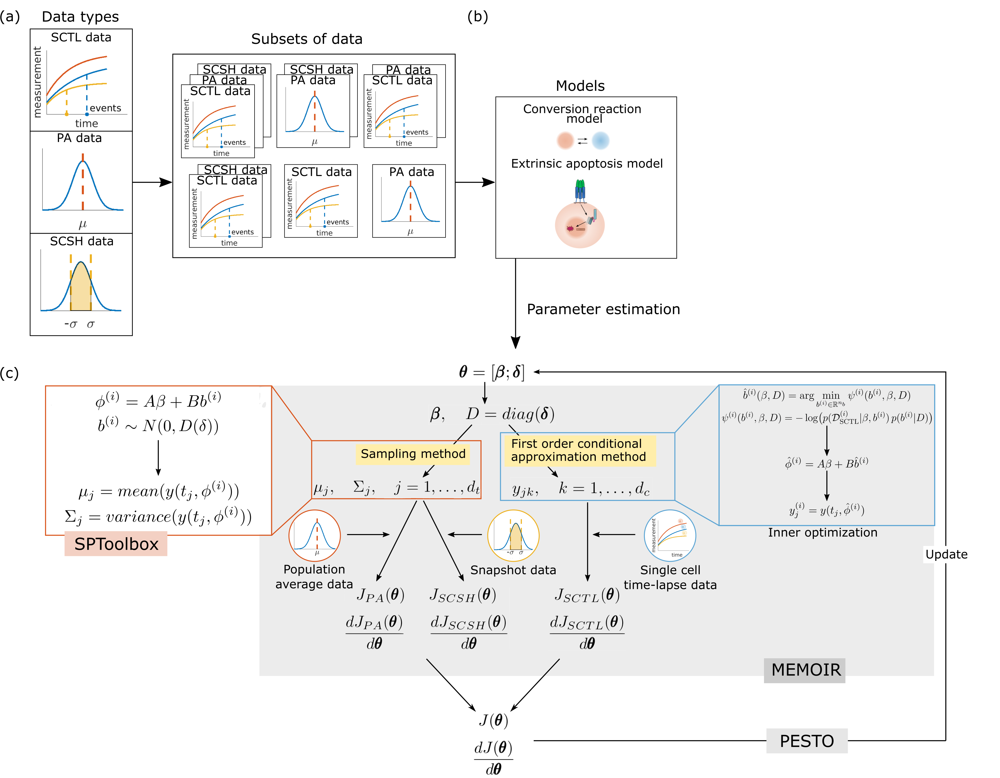

# Extrinsic apoptosis & Conversion reaction model

This repository provides the reproducible code accompanying the manuscript "Nonlinear Mixed-Effect Models and Tailored Parameterization Schemes Enable Integration of Single-Cell and Bulk Data". The repository contains implementations for both the extrinsic apoptosis model and the conversion reaction model used in the study.



### Requirements
MATLAB version tested : R2017a and R2017b
* Required MathWorks toolboxes: 
- Optimization

- Statistics

- Symbolic Math Toolbox

### Dependencies

TThis project utilizes several MATLAB toolboxes available in the `./toolboxes` directory:
* **AMICI:** MATLAB and C++ interface for the SUNDIALS solvers CVODES (for ordinary differential equations) and IDAS (for algebraic differential equations).
* **MEMOIR:** MATLAB toolbox for Mixed Effect Model InfeRence.
* **PESTO:** Parameter EStimation TOolbox.
* **SPToolbox:** MATLAB toolbox allows for different Dirac mixture distribution methods to approximate Gaussian distributions.

### Setup

You can either clone the Extrinsic-apoptosis-Conversion-reaction-model repository via git clone git@github.com:ICB-DCM/Extrinsic-apoptosis-Conversion-reaction-model.git, or download the repository. 

Add all required toolboxes to your MATLAB search path:
```shell
addpath(genpath('./toolboxes/MEMOIR'))
addpath(genpath('./toolboxes/AMICI'))
addpath(genpath('./toolboxes/PESTO'))
addpath(genpath('./toolboxes/SPToolbox'))
```

### Reproducing the manuscript results
Both model folders (`conversion_reaction_model` and `extrinsic_apoptosis_model`) follow similar structures (see **Project structure** part for details). Below we demonstrate the workflow using the conversion reaction model as an example.
**Reproducing parameter estimation**

- Compile model
```shell
cd conversion_reaction_model\project\models\
compileModels
```

- Generate model files
```shell
cd conversion_reaction_model\
generateModelFiles
```

- Parameter estimation
```shell
cd conversion_reaction_model\
optimize_conversion(scenario,k)
```
where, scenario (1, 2, 3, 4, 5, 6) is a number represent the different scenarios in the manuscript. k is the index number of the different multi-starts. In the manuscript, we used 1-100 for conversion reaction model and 1-550 for the extrinsic apoptosis model.

**Analysis Only (Using Pre-computed Results)**

Since parameter estimation can be computationally intensive, pre-computed results are available for analysis. Please first download the estimated results (from zenodo: https://doi.org/10.5281/zenodo.18028185) . Then copy the folders in "results_for_manuscript/optimized_parameters" to the foder `conversion_reaction_model` or `extrinsic_apoptosis_model` correspondingly.

Simulated results used for Figure 5 and Figure 6 can be found in "results_for_manuscript/simulated_data_using_optimized_parameters"

- Comparison of sigma point and Monte Carlo sampling method
```shell
generate_SP_approximation(nsamples, approx)
generate_SPcomparison
```
where nsamples is the number of Monte Carlo sampling method, in the manuscript we used 100, 1000, 10000, 50000, 100000, 1000000. approx is a str represent the method used for computation, in the manuscript we used 'SP' and 'samples'. The results computed for the manuscript is in "results_for_manuscript/comparison_SP_MC".

- Gradient analysis
```shell
check_gradient(s)
gradient_computation_time(s, step_size)
```
where i is the number of scenario and step_size is the step size used for finite difference method. The results computed for the manuscript is in "results_for_manuscript/check_gradient".

- Single cell parameters
```shell
getSingleCellPar(scenario)
```
where scenario is the number of scenario. The results computed for the manuscript is in "results_for_manuscript/scenario1_singleCellParameters".

- Inner optimization
```shell
inner_optimization(dataset, i_cell)
```
where dataset is an int between 1-8, representing the index of single-cell time-lapse data. i_cell is an int representing the index of cell, which is 1-30 for dataset 1-4, and 1-10 for dataset 5-8. The results computed for the manuscript is in "results_for_manuscript/inner_optimization".

- Hession computation
```shell
getHessianOpt(scenario, k)
```
where scenario is the number scenario and k is the index of parameter (1-35) used for Hession computation. The results computed for the manuscript is in "results_for_manuscript/optimized_parameters".

### Project structure

The repository contains two main folders, conversion_reaction_model and extrinsic_apoptosis_model for the two models used in the manuscript, toolbox folder for MATLAB toolboxes used in this project and img folder contains the main image. The main model folders have similar structures including models, data and scripts for parameter estimation and data analysis. More details can be found in the file "file_info.txt".

**conversion_reaction_model**

|   check_gradient.m

|   generateDataFiles.m

|   generateModelFiles.m

|   generate_artificial_PAdata.m

|   generate_artificial_SCTLdata.m

|   generate_SPcomparison.m

|   generate_SP_approximation.m

|   getPlotSetting.m

|   gradient_computation_time.m

|   optimize_conversion.m

|   PA_syn.mat

|   SCTL_syn.mat

|   SynData.mat

|   

+---check_gradient

+---project

|   |   model_conversion.m

|   |   syn_conversion.m

|   |   

|   \---models

|           compileModels.m

|           conversion_PA_sym.m

|           conversion_SCTL_sym.m

|           

\---singleCellParameters

**extrinsic_apoptosis_model**

|   check_gradient.m

|   ExpData.mat

|   ExpModel.mat

|   generateModelFiles.m

|   generate_SPcomparison.m

|   generate_SP_approximation.m

|   getHessianOpt.m

|   getPlotSetting.m

|   getSCTLSetting.m

|   getSingleCellPar.m

|   gradient_computation_time.m

|   inner_optimization.m

|   model_output_SP.m

|   optimize_C8S.m

|   PAt0_C8_post_processing.m

|   PA_C8_post_processing.m

|   

+---check_gradient

+---project

|   |   experiments_caspase8.m

|   |   model_caspase8_diag.m

|   |   

|   \---models

|           compileModels.m

|           model_C8S_A_FACS_syms.m

|           model_C8S_A_PAt0_syms.m

|           model_C8S_A_PA_syms.m

|           model_C8S_A_syms.m

|           model_C8S_H_FACS_syms.m

|           model_C8S_H_PAt0_syms.m

|           model_C8S_H_syms.m

|           

\---singleCellParameters

**toolboxes**
+---MEMOIR

+---AMICI

+---PESTO

+---SPToolbox

### License

Distributed under the [MIT](https://opensource.org/licenses/MIT) License. See `LICENSE` file for more information.

### How to cite

Related zenodo repository:  https://doi.org/10.5281/zenodo.18028185